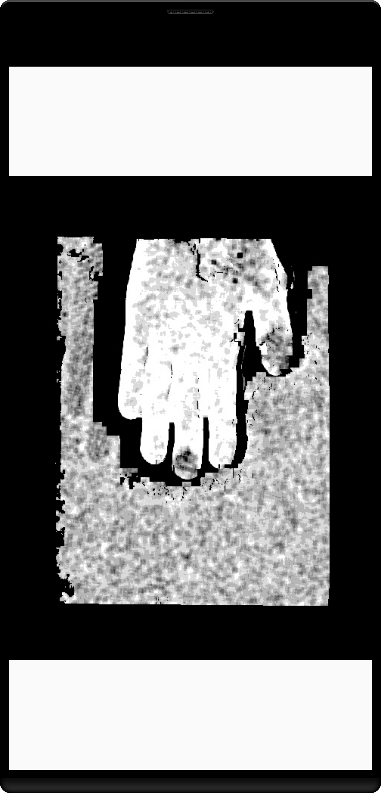

Android Camera2Basic Sample
===========================

This sample demonstrates using the Camera2 API to capture a JPEG, DEPTH or RAW frame.
Check the source code to see a simple example of how to display the camera preview
and capture a still image using the default configuration with the selected pixel
format.

Introduction
------------

The [Camera2 API][1] allows users to capture RAW images, i.e. unprocessed pixel data
directly from the camera sensor that has not yet been converted into a format and
colorspace typically used for displaying and storing images viewed by humans.  The
[DngCreator][2] class is provided as part of the Camera2 API as a utility for saving
RAW images as DNG files.

This sample displays a live camera preview in a TextureView, and saves JPEG and DNG
file for each image captured.

[1]: https://developer.android.com/reference/android/hardware/camera2/package-summary.html
[2]: https://developer.android.com/reference/android/hardware/camera2/DngCreator.html

Pre-requisites
--------------

- Android SDK 29+
- Android Studio 3.5+

Screenshots
-------------

 

Getting Started
---------------

This sample uses the Gradle build system. To build this project, use the
"gradlew build" command or use "Import Project" in Android Studio.

Support
-------

- Stack Overflow: http://stackoverflow.com/questions/tagged/android

If you've found an error in this sample, please file an issue:
https://github.com/android/camera-samples

Patches are encouraged, and may be submitted by forking this project and
submitting a pull request through GitHub. Please see CONTRIBUTING.md for more details.
