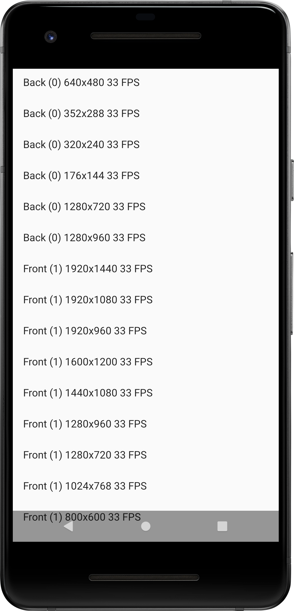

Android Camera2Video Sample
===========================

This sample captures video record via the Camera2 API including displaying
a camera preview and capturing a high-speed (slow motion) video using
repeating capture requests.

Introduction
------------

The [Camera2 API][1] allows users to capture video from the camera by
sending repeating capture requests from the camera framework to a
[media recorder][2].

This sample displays a live camera preview in SurfaceView, allows the user to
press and hold the screen to record a video, and also encodes the recording
in an MP4 video file.

[1]: https://developer.android.com/reference/android/hardware/camera2/package-summary.html
[2]: https://developer.android.com/reference/android/media/MediaRecorder

Pre-requisites
--------------

- Android SDK 29+
- Android Studio 3.6+
- Device with video capture capability (or emulator)

Screenshots
-------------

Getting Started
---------------

This sample uses the Gradle build system. To build this project, use the
"gradlew build" command or use "Import Project" in Android Studio.

Support
-------

- Stack Overflow: http://stackoverflow.com/questions/tagged/android

If you've found an error in this sample, please file an issue:
https://github.com/android/camera-samples

Patches are encouraged, and may be submitted by forking this project and
submitting a pull request through GitHub. Please see CONTRIBUTING.md for more details.
