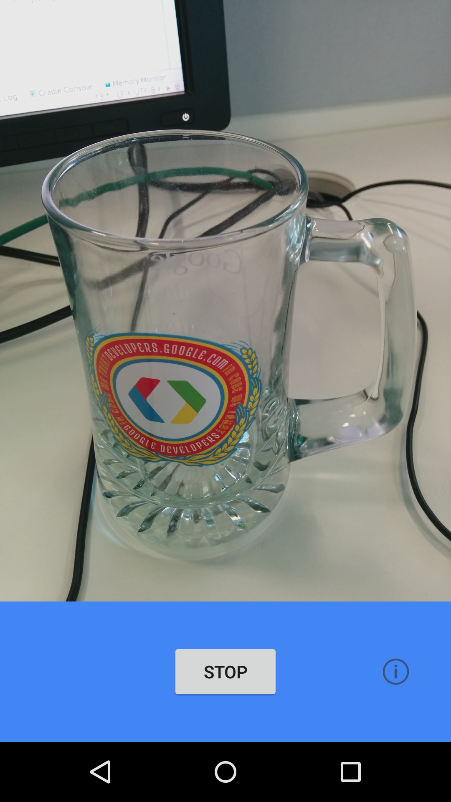
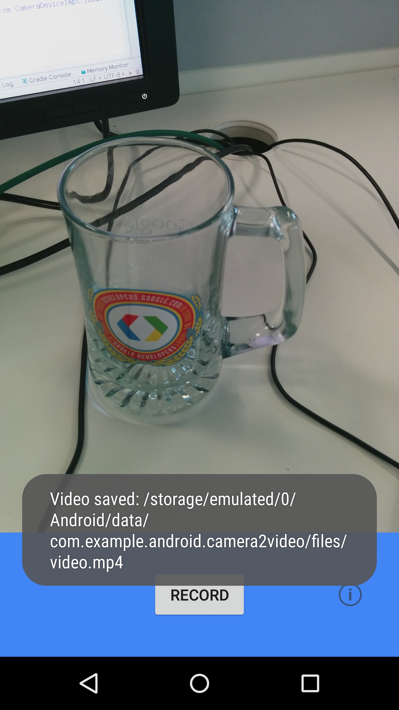

Android Camera2Video Sample
===================================

This sample shows how to record video using the new Camera2 API in Android Lollipop.

Introduction
------------

Android Lollipop introduced a new camera API, called camera2. This sample uses [CameraDevice][1]
and [CameraCaptureSession][2] to record video. It also uses a custom [TextureView][3] to render the output.

The main steps are:

1. Create a custom TextureView class and add it to the layout. The purpose of the custom TextureView is
to be able to draw itself according to an aspect ratio, which is set via a public method. Additionally,
the `onMeasure(int widthMeasureSpec, int heightMeasureSpec)` method is overridden, using the aspect ratio.
2. Implement a `TextureView.SurfaceTextureListener` on your TextureView, and override its
`onSurfaceTextureSizeChanged(SurfaceTexture surfaceTexture, int width, int height)` method to calculate
the matrix to apply to the TextureView so the camera output fits. Use the method `setTransform(matrix)` on
the TextureView.
3. Implement a [`CameraDevice.StateCallback`][4] to receive events about changes of the state of the
camera device. Override its methods to set your CameraDevice instance, start the preview, and stop
and release the camera.
4. When starting the preview, set up the MediaRecorder to accept video format.
5. Then, set up a [`CaptureRequest.Builder`][5] using `createCaptureRequest(CameraDevice.TEMPLATE_RECORD)`
on your CameraDevice instance.
6. Then, implement a [`CameraCaptureSession.StateCallback`][6], using the method
`createCaptureSession(surfaces, new CameraCaptureSession.StateCallback(){})` on your CameraDevice instance,
where `surfaces` is a list consisting of the surface view of your TextureView and the surface of
your MediaRecorder instance.
7. Use `start()` and `stop()` methods on your MediaRecorder instance to actually start and stop the recording.
8. Lastly, set up and clean up your camera device in `onResume()` and `onPause()`.

[1]: https://developer.android.com/reference/android/hardware/camera2/CameraDevice.html
[2]: http://developer.android.com/reference/android/hardware/camera2/CameraCaptureSession.html
[3]: http://developer.android.com/reference/android/view/TextureView.html
[4]: https://developer.android.com/reference/android/hardware/camera2/CameraDevice.StateCallback.html
[5]: http://developer.android.com/reference/android/hardware/camera2/CaptureRequest.Builder.html
[6]: http://developer.android.com/reference/android/hardware/camera2/CameraCaptureSession.StateCallback.html

Pre-requisites
--------------

- Android SDK 28
- Android Build Tools v28.0.3
- Android Support Repository

Screenshots
-------------

   

Getting Started
---------------

This sample uses the Gradle build system. To build this project, use the
"gradlew build" command or use "Import Project" in Android Studio.

Support
-------

- Google+ Community: https://plus.google.com/communities/105153134372062985968
- Stack Overflow: http://stackoverflow.com/questions/tagged/android

If you've found an error in this sample, please file an issue:
https://github.com/googlesamples/android-Camera2Video

Patches are encouraged, and may be submitted by forking this project and
submitting a pull request through GitHub. Please see CONTRIBUTING.md for more details.
