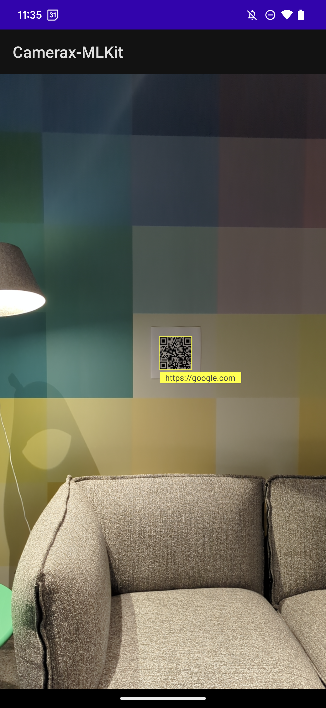

# CameraX-MLKit

This example uses CameraX's MlKitAnalyzer to perform QR Code scanning. For QR Codes that encode Urls, this app will prompt the user to open the Url in a broswer. This app can be adapted to handle other types of QR Code data.

The interesting part of the code is in `MainActivity.kt` in the `startCamera()` function. There, we set up BarcodeScannerOptions to match on QR Codes. Then we call `cameraController.setImageAnalysisAnalyzer` with an `MlKitAnalyzer` (available as of CameraX 1.2). We also pass in `COORDINATE_SYSTEM_VIEW_REFERENCED` so that CameraX will handle the cordinates coming off of the camera sensor, making it easy to draw a box around the QR Code. Finally, we create a QrCodeDrawable, which is a class defined in this sample, extending View, for displaying an overlay on the QR Code and handling tap events on the QR Code.

You can open this project in Android Studio to explore the code further, and to build and run the application on a test device.

## Screenshots



## Command line options 

### Build

To build the app directly from the command line, run:
```sh
./gradlew assembleDebug
```

### Test

Unit testing and instrumented device testing share the same code. To test the app using Robolectric, no device required, run:
```sh
./gradlew test
```

To run the same tests in an Android device connected via ADB, run:
```sh
./gradlew connectedAndroidTest
```

Alternatively, test running configurations can be added to Android Studio for convenience (and a nice UI). To do that:
1. Go to: `Run` > `Edit Configurations` > `Add New Configuration`.
1. For Robolectric select `Android JUnit`, for connected device select `Android Instrumented Tests`.
1. Select `app` module and `com.android.example.cameraxbasic.MainInstrumentedTest` class.
1. Optional: Give the run configuration a name, like `test robolectric` or `test device`
