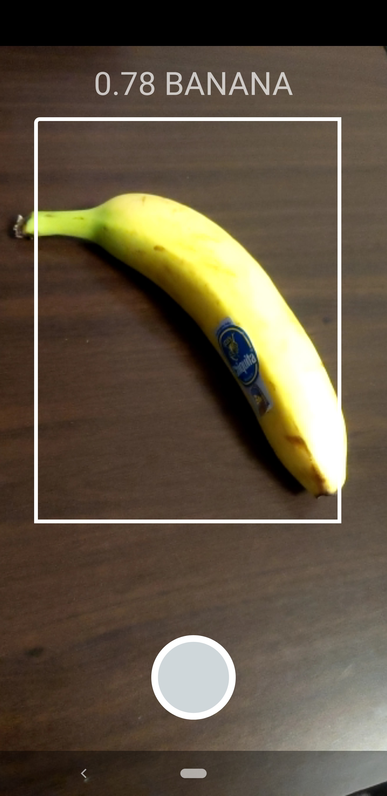

# CameraX + Tensorflow Lite
This is a collection of examples to demonstrate CameraX usage in different areas such as TFLite,
and the list will grow along with CameraX advancing footprints.

## TensorFlow Lite(TFLite)
This example implements an Activity that performs real-time object detection on
the live camera frames. It performs the following operations:
1. Initializes camera preview and image analysis frame streams using CameraX
2. Loads a mobilenet quantized model using Tensorflow Lite
4. Performs inference on the transformed frames and reports the object predicted on the screen

The whole pipeline is able to maintain 30 FPS on a Pixel 3 XL with:
- the default image size from Camera (640x480)
- the default tensor size (300 x 300)

## Screenshots

