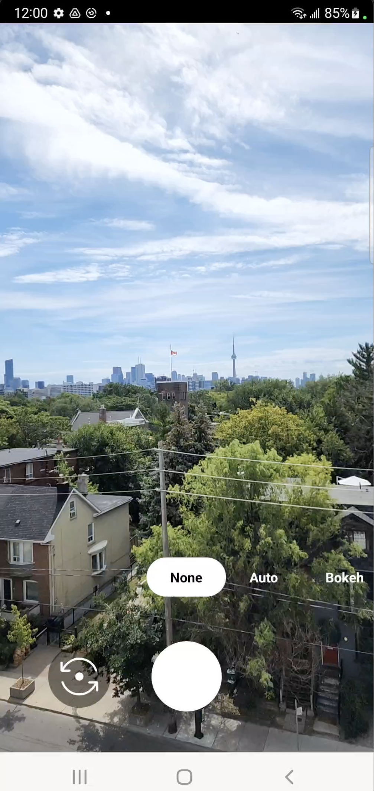
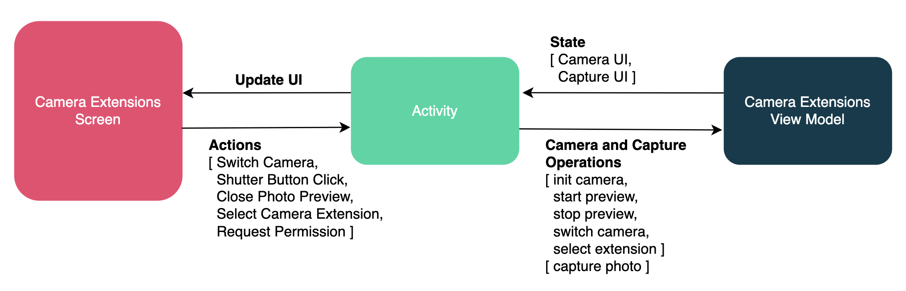

Android CameraX Extensions Sample
=================================

This sample demonstrates using Camera Extensions with CameraX API to capture a JPEG.
The source code shows an example of how to display the camera preview, query for
supported extensions, select an extension, and capture a still image.

Introduction
------------

The [CameraX Extensions API][1] allows users to apply manufacturer specific
extensions to still captures. The available extensions include: Auto, Bokeh, Face
Retouch, HDR (High Dynamic Range), and Night.

This sample displays the available list of camera extensions for the selected camera
lens. Selecting an extensions allows the user to capture a still using that
extension.

[1]: https://developer.android.com/training/camerax/vendor-extensions

Pre-requisites
--------------

- Android SDK 32+
- Android Studio 3.5+

Screenshots
-------------

Architecture:
The sample demonstrates using an MVVM architecture. The view model emits the camera
state and capture state. The UI emits actions. The activity acts as the mediator
between the view model and view.
 

Getting Started
---------------

This sample uses the Gradle build system. To build this project, use the
"gradlew build" command or use "Import Project" in Android Studio.

Support
-------

- Stack Overflow: http://stackoverflow.com/questions/tagged/android

If you've found an error in this sample, please file an issue:
https://github.com/android/camera-samples

Patches are encouraged, and may be submitted by forking this project and
submitting a pull request through GitHub. Please see CONTRIBUTING.md for more details.
