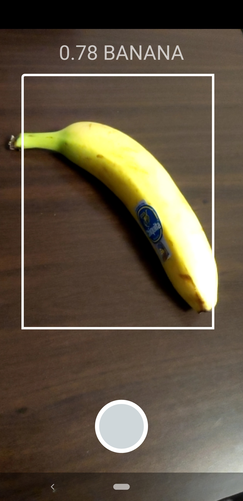

# CameraX + Tensorflow Lite
This sample implements an Activity that performs real-time object detection on
the live camera frames. It performs the following operations:
1. Initializes camera preview and image analysis frame streams using CameraX
2. Loads a mobilenet quantized model using Tensorflow Lite
3. Converts each incoming frame to the RGB colorspace and resizes it to 224x224 pixels
4. Performs inference on the transformed frames and reports the object predicted on the screen

The whole pipeline is able to maintain 30 FPS on a Pixel 3 XL.

## Screenshots

