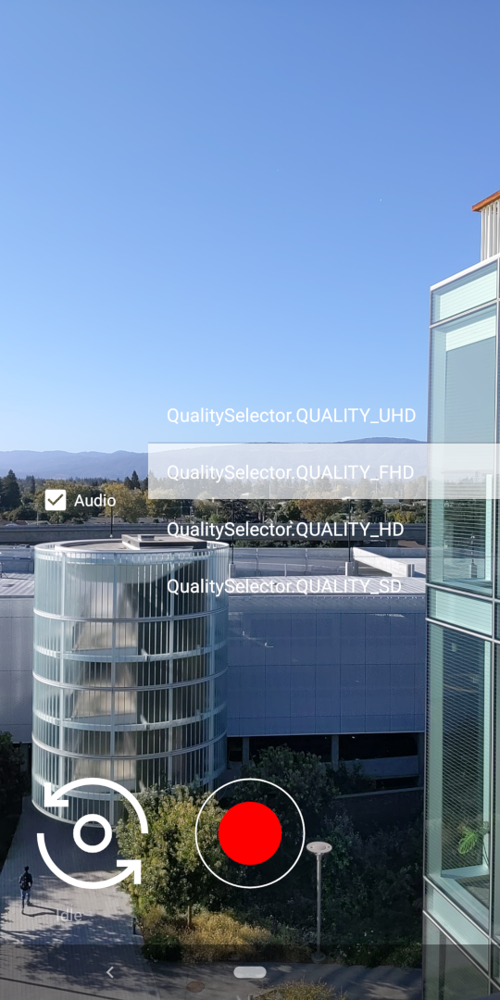

Android CameraXVideo Sample
===========================

This sample demonstrates CameraX Video Capture (Recorder) API with Capture + Preview use case combination.
VideoCapture is in early release cycle, try it out and share your
thoughts and experience; especially for the functionalities you need but unavailable,
please let us know [hear](https://groups.google.com/a/android.com/g/camerax-developers) them.

Introduction
------------
CameraX VideoCapture is available from [version 1.1.0-alpha10+](https://developer.android.com/jetpack/androidx/releases/camera), can capture to local file with the formats of:
- [MediaStore](https://developer.android.com/reference/android/provider/MediaStore)
- [File](https://developer.android.com/reference/java/io/File)
- [FileDescriptor](https://developer.android.com/reference/java/io/FileDescriptor)

This sample demonstrates MediaStore capture case, the other 2 types are very similar
(just replacing the MediaStoreOutputOptions with FileOutputOptions or
FileDescriptorOutputOptions in CameraFragment.kt).

Conceptually 3 steps to use video recorder in this Alpha version: create a recorder(use it to create recordings),
bind it to pipeline, record with recording (created from recorder). A little more detailed steps:
1. Create a QualitySelector(video resolution) -> Recorder -> VideoCapture<Recorder>
2. Bind the VideoCapture to the CameraLifeCycle (with a CameraSelector) (Camera needs some time to settle)
3. further configure the Recorder:
- set OutputOptions(MediaStoreOutputOptions, FileDescriptorOutputOptions, FileOutputOptions): location and size. This step returns PendingRecording object
- enable audio, register VideoRecordEvent with the PendingRecording object
4. start() capture, returning ActiveRecording object
5. pause(), resume(), stop()/close() with the ActiveRecording
6. react to capture events: app gets notifications from the registered VideoRecordEvent listener for recording state changes

The steps are not strict, but some do have dependencies (like Recorder created then bind);
recordings could be created before or after binding, but activeRecording needs to be after binding.
VideoCapture does not support multiple concurrent streams(capturing),so only one ActiveRecording could exists.

Related code is in CameraFragment.kt (in its own fragment), and most of the code deals with UI, the essential
VideoCapture code is quite simple and straightforward (in startVideoCapture() function )

To learn more about the VideoCapture, refer to
- [the official documentation](https://developer.android.com/training/camerax/video-capture)
- [the latest API list](https://github.com/androidx/androidx/blob/androidx-main/camera/camera-video/api/current.txt)
- [Camerax release notes](https://developer.android.com/jetpack/androidx/releases/camera)

Pre-requisites
--------------
- Android SDK 31+
- Android Studio Arctic Fox (2020.3.1)
- Device with video capture capability (or emulator)

Getting Started
---------------
This sample uses the Gradle build system. To build this project, use the
"gradlew build" command or use "Import Project" in Android Studio.

Screenshots
-------------

Support
-------

- Stack Overflow: http://stackoverflow.com/questions/tagged/android

If you've found an error in this sample, please file an issue:
https://github.com/android/camera-samples

Patches are encouraged, and may be submitted by forking this project and
submitting a pull request through GitHub. Please see CONTRIBUTING.md for more details.
