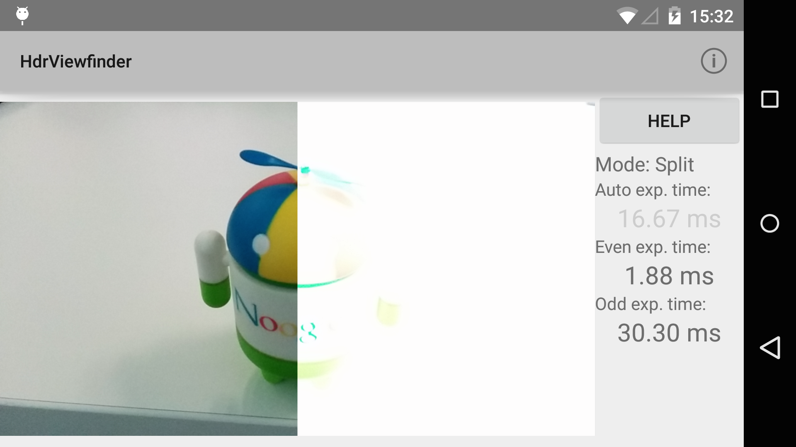

Android HdrViewfinder Sample
===================================

This demo implements a real-time high-dynamic-range camera viewfinder, by alternating
the sensor's exposure time between two exposure values on even and odd frames, and then
compositing together the latest two frames whenever a new frame is captured.

Introduction
------------

A small demo of advanced camera functionality with the Android camera2 API.

This demo implements a real-time high-dynamic-range camera viewfinder,
by alternating the sensor's exposure time between two exposure values on even and odd
frames, and then compositing together the latest two frames whenever a new frame is
captured.

The demo has three modes: Regular auto-exposure viewfinder, split-screen manual exposure,
and the fused HDR viewfinder.  The latter two use manual exposure controlled by the user,
by swiping up/down on the right and left halves of the viewfinder.  The left half controls
the exposure time of even frames, and the right half controls the exposure time of odd frames.

In split-screen mode, the even frames are shown on the left and the odd frames on the right,
so the user can see two different exposures of the scene simultaneously.  In fused HDR mode,
the even/odd frames are merged together into a single image.  By selecting different exposure
values for the even/odd frames, the fused image has a higher dynamic range than the regular
viewfinder.

The HDR fusion and the split-screen viewfinder processing is done with RenderScript; as is the
necessary YUV->RGB conversion. The camera subsystem outputs YUV images naturally, while the GPU
and display subsystems generally only accept RGB data.  Therefore, after the images are
fused/composited, a standard YUV->RGB color transform is applied before the the data is written
to the output Allocation. The HDR fusion algorithm is very simple, and tends to result in
lower-contrast scenes, but has very few artifacts and can run very fast.

Data is passed between the subsystems (camera, RenderScript, and display) using the
Android [android.view.Surface][1] class, which allows for zero-copy transport of large
buffers between processes and subsystems.

[1]: http://developer.android.com/reference/android/view/Surface.html

Pre-requisites
--------------

- Android SDK 28
- Android Build Tools v28.0.3
- Android Support Repository

Screenshots
-------------

 

Getting Started
---------------

This sample uses the Gradle build system. To build this project, use the
"gradlew build" command or use "Import Project" in Android Studio.

Support
-------

- Google+ Community: https://plus.google.com/communities/105153134372062985968
- Stack Overflow: http://stackoverflow.com/questions/tagged/android

If you've found an error in this sample, please file an issue:
https://github.com/android/camera-samples/issues

Patches are encouraged, and may be submitted by forking this project and
submitting a pull request through GitHub. Please see CONTRIBUTING.md for more details.
