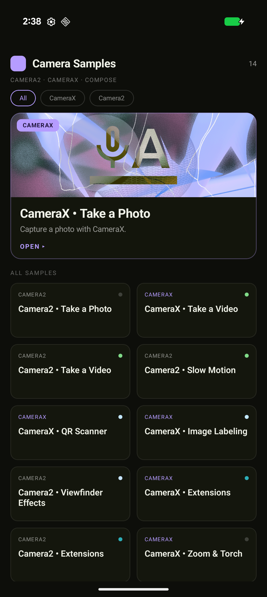
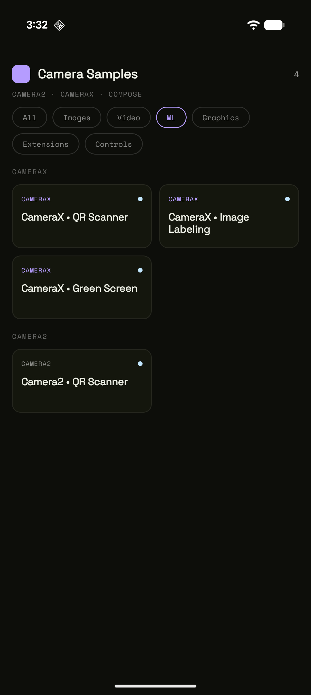

# Android Camera Samples Catalog

A single, stand-alone Android app that showcases the **Camera2** and **CameraX** APIs through a
catalog of small, self-contained, **Compose-first** samples. Each sample focuses on one feature and
reuses a shared camera-scaffolding layer, so adding a new sample means writing the feature — not the
boilerplate.

## Screenshots

The home catalog in the "Console" theme — a violet accent, monospace metadata, a bordered featured
card, and a dense 2-column grid. The filter pills narrow the catalog by API (right: Camera2 only).

<p align="center">
  
  &nbsp;&nbsp;&nbsp;
  
</p>

## How to run

1. Clone the repository.
2. Open it in a recent Android Studio.
3. Run the `app` configuration on a device or emulator. Camera-dependent samples (extensions,
   slow-motion, ML) behave best on a physical device; emulators with a virtual camera cover the
   basics.

No Firebase / `google-services.json` is required.

## Samples

Filter the catalog by **All / CameraX / Camera2** on the home screen.

| Sample | API | What it shows |
| --- | --- | --- |
| Take a Photo | CameraX / Camera2 | Preview, tap-to-focus, capture a still |
| Take a Video | CameraX (Recorder) / Camera2 (MediaRecorder) | Record video to `DCIM/Camera` |
| Pause/Resume | CameraX (Recorder) | Pause and resume a recording mid-capture |
| Slow Motion | Camera2 | High-speed (constrained) recording |
| QR Scanner | CameraX / Camera2 + ML Kit | Real-time barcode/QR detection with overlay |
| Image Labeling | CameraX + ML Kit | Real-time on-device labels via `ImageAnalysis` |
| Luminosity | CameraX | Scene-brightness meter from the `ImageAnalysis` Y plane |
| Green Screen | CameraX + ML Kit | Concurrent cameras: segment the front-camera subject over the live back camera |
| Extensions | CameraX / Camera2 | Night / Bokeh / HDR / Face Retouch / Auto |
| Ultra HDR | CameraX | Gain-map Ultra HDR (`JPEG_R`) still capture |
| Effects | CameraX | Live color filters (grayscale, sepia, invert, …) via `ImageAnalysis` + `ColorMatrix` |
| Viewfinder Effects | Camera2 | Real-time frame processing on the live preview |
| Concurrent Camera | CameraX | Front + back preview at once (picture-in-picture) |
| RAW / DNG | Camera2 | `RAW_SENSOR` → DNG via `DngCreator`, then an in-app viewer/editor (re-expose, re-white-balance) |
| Zoom & Torch | CameraX / Camera2 | Zoom ratio slider + torch toggle |
| Exposure | CameraX | Exposure-compensation slider |
| Manual Controls | Camera2 | Manual ISO / shutter / focus distance |

Samples that depend on optional hardware (extensions, high-speed recording, manual sensor) detect
support at runtime and show a friendly "not supported on this device" state instead of crashing.

## Architecture

Every sample is a Gradle **library module** under `samples/{api}-{feature}/`
(package `com.android.{api}.{feature}`) exposing a single `{Api}{Feature}Screen()` composable. It
follows the layered, unidirectional pattern in [android_architecture.md](android_architecture.md):

- **`{Feature}UiState`** — a `sealed interface` of states (`Initial`, feature states, `Error`).
- **`{Feature}ViewModel`** — a `@HiltViewModel` exposing a single `StateFlow<UiState>`; no
  Android/lifecycle references.
- **`{Feature}Controller`** — a `@Stable` state-holder that owns the camera SDK lifecycle, created
  with a `remember{Feature}Controller(...)` composable.
- **`{Feature}Screen`** — collects state with `collectAsStateWithLifecycle`, wraps everything in the
  shared scaffold, and renders with a `when(state)`.

### Shared modules

The scaffolding that used to be copy-pasted into every sample lives in three shared modules, so a new
sample focuses only on its feature:

- **`:core-theme`** — the design system: the Material 3 color scheme with the violet "Console" accent,
  Space Grotesk / Space Mono typography (via Google Fonts), and the `AISampleCatalogTheme` wrapper.
- **`:core-camera`** — camera plumbing: `BaseCamera2Controller` (background thread, open/close,
  viewfinder transform, tap-to-focus, session creation), `Camera2Preview` / `CameraXPreview`,
  `ImageUtils` (`Image`/`ImageProxy` → `Bitmap`), `MediaStoreSaver`, `rememberDisplayRotation()`,
  and `CameraPermissions`. It re-exports the common CameraX/Camera2 libraries.
- **`:core-ui`** — API-agnostic Compose chrome: `CameraSampleScaffold` (permission flow + surface),
  the viewfinder HUD (`FocusIndicator` reticle, `RuleOfThirdsGrid`, `ViewfinderTitleChip`,
  `TorchChip`), `ShutterButton` / `RecordButton` / `CameraControlsBar` / `ScrimIconButton`,
  `ValueSlider` / `ZoomControls`, `CapturedImagePreview` / `CapturedVideoPreview` / `VideoPlayer`,
  the `SettingsOverlay` menu, and the loading / error / unsupported state views. It re-exports
  `:core-camera` and `:core-theme`.

A sample is registered in one place — a `SampleCatalogItem` in
[SampleCatalog.kt](app/src/main/java/com/android/camera/catalog/domain/SampleCatalog.kt) — and the
app's `NavHost` is derived from that list automatically.

## Adding a new sample

Use the generator, which scaffolds a working (preview-only) compose-first module and wires it into
the build and catalog:

```bash
./gradlew createSample \
  -PsampleName="camera2-flash" \
  -PscreenName="Camera2FlashScreen" \
  -Ptitle="Camera2 • Flash" \
  -Pdesc="Toggle the flash with Camera2" \
  -Ptype="camera2"          # camera2 (default) or camerax

./gradlew spotlessApply      # format the generated files
```

Then implement the feature in the generated `Controller` / `Screen` and re-sync Gradle.

## Code style

The project is formatted with [Spotless](https://github.com/diffplug/spotless) (ktlint + Apache
license headers). Run `./gradlew spotlessApply` before committing.
